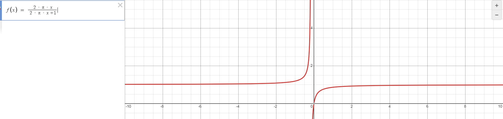
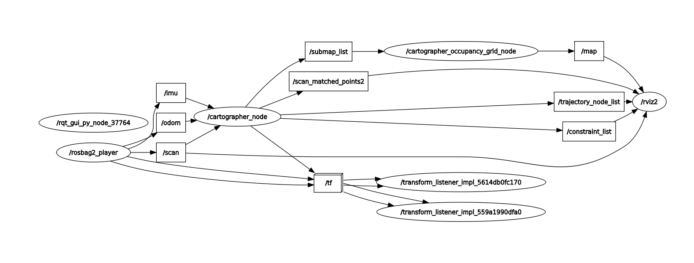
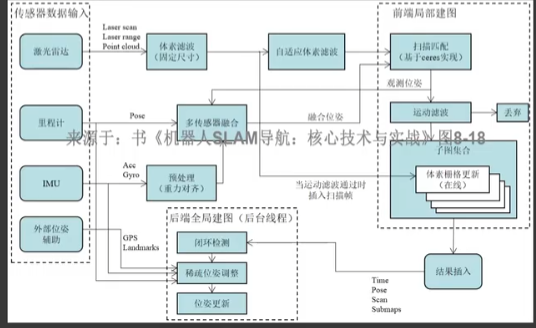
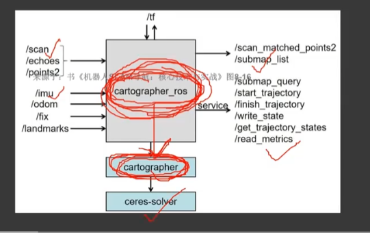

# 计划

## C++

### GDB调试

... 


## ROS学习

### 机器人软件系统

#### 传感器驱动（节点的数据通信）


#### 传感器数据处理


#### 建图定位

  由于我们使用的是cartographer，https://google-cartographer-ros.readthedocs.io


#### 规划控制


#### 

## ROS2学习

* wsl2上安装ubuntu22.04
* 安装ros-humble
* wsl2无法启动图形界面，Win10需要打开`hyper-v`。然后使用xclock进行测试
* 安装对应ros pkg进行学习
* 

### 滤波

参考python部分的代码`filter.py`

* 高通滤波：[哔哩哔哩-高通滤波分享](https://www.bilibili.com/video/BV11u411q7VB/?spm_id_from=333.337.search-card.all.click&vd_source=0374b86c7587c32da2804e3c3c154f3a)
* 低通滤波：阻止高频信号，低频变化信号能通过 公式:$a[i] = a[i] * \alpha  + (1 - \alpha )* a[i-1]$, $\alpha$的取值范围 0 ~ 1，0表示任何变化都不会通过，1则全部通过。$\alpha = \frac{2 * PI * fc}{2 * PI * fc + 1}$。$\alpha$为衰减系数。$fc$为截止频率。关系如下图
* 现代滤波器：统计学方法，其中卡尔曼滤波就是其中之一

#### 卡尔曼滤波

核心模块

* 状态向量：
* 测量向量


```
KalmanFilter
dim_x 是状态向量的维度。
dim_z 是测量向量的维度。


```

### pid

仿真PID模拟器。理解如何调参。感受一下每个参数的含义
[在线PID模拟器](https://royvegard.github.io/PID%20control%20simulator.html)

### turtlebot3仿真环境使用

#### 启动

https://ros2-industrial-workshop.readthedocs.io/en/latest/_source/navigation/ROS2-Cartographer.html
根据这篇文档进行ROS2-Cartographer

turtlebot3仿真环境启动
```
export TURTLEBOT3_MODEL=burger
export GAZEBO_MODEL_PATH=`ros2 pkg prefix turtlebot3_gazebo`/share/turtlebot3_gazebo/models/
ros2 launch turtlebot3_gazebo turtlebot3_world.launch.py
```

使用cartographer开始建图

```
ros2 launch turtlebot3_cartographer cartographer.launch.py
```

ros2 launch turtlebot3_navigation2 navigation2.launch.py use_sim_time:=true map:=maps/map.yaml
**修改burger.yaml配置文件内容"robot_model_type: "differential" 变为robot_model_type: "nav2_amcl::DifferentialMotionModel" 地图就可正常显示**
仿真能正常使用了。
仿真环境需要使用use_sim_time:=true

#### turtlebot3_cartographer的学习

turtlebot3_cartographer可以在lua文件进行调参优化建图效果。

```
options = {
  map_builder = MAP_BUILDER, 
  trajectory_builder = TRAJECTORY_BUILDER,
  map_frame = "map",
  tracking_frame = "imu_link",
  published_frame = "odom",
  odom_frame = "odom",
  provide_odom_frame = false,
  publish_frame_projected_to_2d = true,
  use_odometry = true,
  use_nav_sat = true,
  use_landmarks = true,
  num_laser_scans = 1,
  num_multi_echo_laser_scans = 0,
  num_subdivisions_per_laser_scan = 1,
  num_point_clouds = 0,
  lookup_transform_timeout_sec = 0.2,
  submap_publish_period_sec = 0.3,
  pose_publish_period_sec = 5e-3,
  trajectory_publish_period_sec = 30e-3,
  rangefinder_sampling_ratio = 1.,
  odometry_sampling_ratio = 1.,
  fixed_frame_pose_sampling_ratio = 1.,
  imu_sampling_ratio = 1.,
  landmarks_sampling_ratio = 1.,
}

MAP_BUILDER.use_trajectory_builder_2d = true

TRAJECTORY_BUILDER_2D.min_range = 0.12
TRAJECTORY_BUILDER_2D.max_range = 3.5
TRAJECTORY_BUILDER_2D.missing_data_ray_length = 3.
TRAJECTORY_BUILDER_2D.use_imu_data = true
TRAJECTORY_BUILDER_2D.use_online_correlative_scan_matching = true 
TRAJECTORY_BUILDER_2D.motion_filter.max_angle_radians = math.rad(0.1)

POSE_GRAPH.constraint_builder.min_score = 0.65
POSE_GRAPH.constraint_builder.global_localization_min_score = 0.7

-- POSE_GRAPH.optimize_every_n_nodes = 0
```

### cartographer学习

整体运动图


#### cartographer



* 前端: Submap和
* 后端: 回环检测。全局优化

核心代码

MapBuilderInterface
```
class MapBuilder : public MapBuilderInterface

/////////////////////////////////////////////

class MapBuilderInterface {
  // Creates a new trajectory builder and returns its index.
  virtual int AddTrajectoryBuilder(
      const std::set<SensorId>& expected_sensor_ids,
      const proto::TrajectoryBuilderOptions& trajectory_options,
      LocalSlamResultCallback local_slam_result_callback) = 0;

  // Creates a new trajectory and returns its index. Querying the trajectory
  // builder for it will return 'nullptr'.
  virtual int AddTrajectoryForDeserialization(
      const proto::TrajectoryBuilderOptionsWithSensorIds&
          options_with_sensor_ids_proto) = 0;

  // Returns the 'TrajectoryBuilderInterface' corresponding to the specified
  // 'trajectory_id' or 'nullptr' if the trajectory has no corresponding
  // builder.
  virtual mapping::TrajectoryBuilderInterface* GetTrajectoryBuilder(
      int trajectory_id) const = 0;

  // Marks the TrajectoryBuilder corresponding to 'trajectory_id' as finished,
  // i.e. no further sensor data is expected.
  virtual void FinishTrajectory(int trajectory_id) = 0;

  // Fills the SubmapQuery::Response corresponding to 'submap_id'. Returns an
  // error string on failure, or an empty string on success.
  virtual std::string SubmapToProto(const SubmapId& submap_id,
                                    proto::SubmapQuery::Response* response) = 0;

  // Serializes the current state to a proto stream. If
  // 'include_unfinished_submaps' is set to true, unfinished submaps, i.e.
  // submaps that have not yet received all rangefinder data insertions, will
  // be included in the serialized state.
  virtual void SerializeState(bool include_unfinished_submaps,
                              io::ProtoStreamWriterInterface* writer) = 0;

  // Serializes the current state to a proto stream file on the host system. If
  // 'include_unfinished_submaps' is set to true, unfinished submaps, i.e.
  // submaps that have not yet received all rangefinder data insertions, will
  // be included in the serialized state.
  // Returns true if the file was successfully written.
  virtual bool SerializeStateToFile(bool include_unfinished_submaps,
                                    const std::string& filename) = 0;

  // Loads the SLAM state from a proto stream. Returns the remapping of new
  // trajectory_ids.
  virtual std::map<int /* trajectory id in proto */, int /* trajectory id */>
  LoadState(io::ProtoStreamReaderInterface* reader, bool load_frozen_state) = 0;

  // Loads the SLAM state from a pbstream file. Returns the remapping of new
  // trajectory_ids.
  virtual std::map<int /* trajectory id in proto */, int /* trajectory id */>
  LoadStateFromFile(const std::string& filename, bool load_frozen_state) = 0;

  virtual int num_trajectory_builders() const = 0;

  virtual mapping::PoseGraphInterface* pose_graph() = 0;

  virtual const std::vector<proto::TrajectoryBuilderOptionsWithSensorIds>&
  GetAllTrajectoryBuilderOptions() const = 0;
};
```
TrajectoryBuilder

#### cartographer_ros



cartographer_ros是为了对接ros所封装的一些接口，ros接口的封装

下面是对源码的一些理解


* node_main.cc： ros的主节点 默认的节点名字cartographer_node
  * StartTrajectoryWithDefaultTopics -> AddTrajectory


* NodeOptions：类似rosparam存放一些配置数据，读取位置是从LuaParameterDictionary，他的代码是从lua文件里面读取的。类似yaml
* MapBuilder：负责
* Trajectory: 翻译成轨迹，一堆submap构成的叫做Trajectory

##### ceres-solver非线性优化库

TODO


#### turtlebot3_navigation2的学习

## 资料

### 别人的面经

https://blog.csdn.net/qq_41667348/article/details/127514574

https://www.nowcoder.com/discuss/399258182479097856

https://blog.csdn.net/CV_Autobot/article/details/128072652

#### 复习顺序

ROS相关

1. ros基础知识，ros1 ros2区别
2. gdb调试
3. ros中node/nodelet区别，topic，service，队列。param
4. PID，差速模型，阿克曼模型，三轮车模型推导
5. 规划控制：A*，迪杰斯特拉，搜索，贝塞尔曲线等算法学习
6. 降噪处理：常用滤波，优缺点，几何，四元数，泛函，多项式，坐标变换，公式推导
7. 图像处理：opencv图像分割，识别
8. 传感器相关：通讯协议相关（i2c，can，ttl）


C++基础：

[面试专区|【30道C++ 基础高频题整理（附答案背诵版）】](https://blog.csdn.net/qq_40522090/article/details/139201975)


Linux


